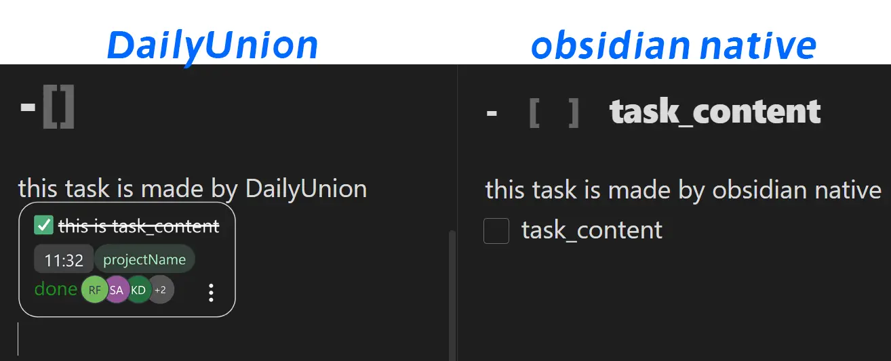

# usage
type "`-[`" or "`]]`" in a editor, and see what will happen. 
# DO NOT USE IN MAIN VAULT
# ATTENTION
Please click "delete" button on task block instead of select and delete.Otherwise, there will be errors in upcoming versions. 

## Manually installing the plugin
- download and unzip `DailyUnion_[version].zip` from release page to your vault `VaultFolder/.obsidian/plugins/`.
> Note: the path should look like this`vault/.obsidian/plugins/DailyUnion/main.js`

# WELCOME CONTRIBUTE
## developing features
I will develop them by order and each item may takes me a few weeks. If you have ability, please help this plugin.
- [ ] edit taskContent by double click instead of Modal
- [ ] round checkbox
## design
if you have better ideas, please create issues first. Attaching images of your design is better.
## language
This plugin will support other languages if it get popularity.We will appreciate it if you can do it.
I am not native speaker.Please feel free to make language PRs.

## build guide
There is a debug button in the left Ribbon. (self-build version only)
```
pnpm install
pnpm run <command in package.json>
```
if you want to run storybook, you will find an error that **storybook can't find**. You need to install storybook **binary** by `pnpm dlx storybook init`

